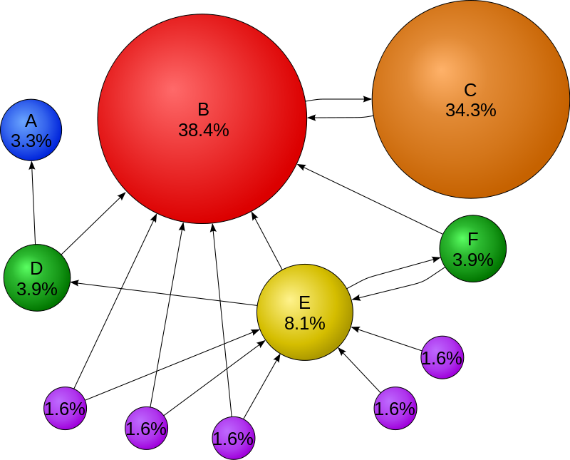

# Simple PageRank
## Background 1: Markov Chains
Certain systems change through a finite number of states over time and behave randomly according to certain probabilities. If the probability that the system will be in a particular state during a given time period depends only on its state during the previous time period, the system is called a Markov chain. Such system can be modeled using transition matrices. A transition matrix is an n x n square matrix P, where n is the number of states of the system, whose elements P(i, j) are positive and whose rows sum to 1. For each i and j, P(i, j) is the probability that given the system was in state i in one time period, it will be in state j during the next time period.

## Background 2: PageRank Algorithm
PageRank is an algorithm used by Google Search to rank websites in their search engine results. PageRank was named after Larry Page, one of the founders of Google. PageRank is a way of measuring the importance of website pages. PageRank works by counting the number and quality of links to a page to determine a rough estimate of how important the website is. The underlying assumption is that more important websites are likely to receive more links from other websites.

The algorithm represents websites (also called documents) as nodes in a directed graph where an edge from website A to website B represents a hyperlink from website A to website B. Simply, the algorithm ranks website by counting the number of links incoming to this website from other websites. In addition, it considers the quality of links by inheriting the PageRank of the source website to increase/decrease the PageRank of the destination website. The picture below shows a graphical representation of some web pages (A, B, C, etc.). Page C has a higher PageRank than page E, even though there are fewer links to C; the one link to C comes from an important page and hence is of high value.

> **Did you know?**
> 
> *Startup companies ask famous websites and blogs to write about their new idea and provide a link to the startup web page. For example, a newly published mobile app can get a high PageRank faster if TechCrunch or TheNextWeb websites wrote about it. One link from a famous website worth hundred links from other smaller one.*

Please, read algorithm detailed description from the [Wikipedia page](https://en.wikipedia.org/wiki/PageRank#Algorithm)

## Algorithm Steps Summary
Given a web of n pages, construct an n × n matrix **P** as:

where nj is the number of outgoing links from node j. 

Note that the sum of jth column is nj/nj=1, So **P** is a Markov matrix.

The initial state vector **p(0)** has equal probability over all entries. For example, if we have 5 pages, the initial state vector is [0.2 0.2 0.2 0.2 0.2]

Now, you have the initial state vector and the transition matrix, can you compute the state vector at **p(1)**? **p(2)**?

PageRank algorithm modifies the transition matrix **P** (before any computation) as follows:

**P = 0.85 P + 0.15** where 0.85 is called a damping factor ([read more about the damping factor](https://en.wikipedia.org/wiki/PageRank#Damping_factor)). Basically, the dumping factor is introduced to scale the transition matrix to all positive numbers to ensure that there is a steady state vector for the system.

Finally, the steady state vector is considered the ranking of the pages. Remember that the steady state vector is equal to **p0.P^n** for sufficiently large n. (alternatively, a steady state vector is where the distribution does not change over two subsequent values of n)

> **Stochastic Interpretation of PageRank:**
> 
> *The authors of PageRank considered web surfing as a stochastic process. It can be thought as a model of user behavior. We assume that there is a “random surfer” who is given a web page at random and keeps clicking on links, never hitting “back” but eventually gets bored and starts on another random page. Surfer clicks on a link on the current page with probability 0.85; opens up a random page with probability 0.15. A page’s rank is the probability the random user will end up on that page, or equivalently the fraction of time the random user spends on that page in the long run.*

## Further Reading

Read more about how Google search works here: [https://www.google.com/insidesearch/howsearchworks/thestory/](https://www.google.com/insidesearch/howsearchworks/thestory/)
